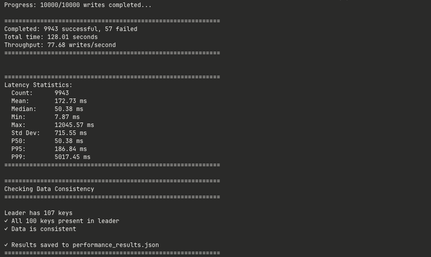
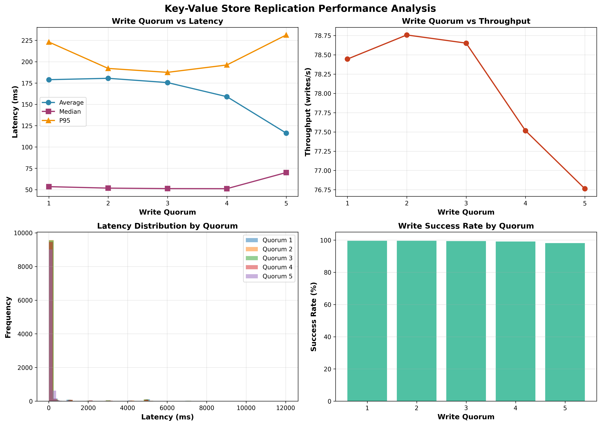

# Lab 4: Key-Value Store with Single-Leader Replication

## How to Run

### Setup and Execution
```bash
# 1. Navigate to lab4 directory
cd lab4

# 2. Activate virtual environment
source venv/bin/activate

# 3. Start Docker containers (1 leader + 5 followers)
docker-compose up -d --build

# 4. Wait a few seconds for services to start, then run tests:

# Basic integration tests
python tests/integration_test.py

# Performance test (10K concurrent writes)
python tests/performance_test.py

# Quorum analysis (tests quorum 1-5, takes ~10-15 minutes)
python tests/quorum_analysis.py

# Check data consistency between leader and all followers
python tests/check_consistency.py

# 5. View results
# - Plots: quorum_analysis.png
# - Data: quorum_analysis_results.json, performance_results.json

# 6. Stop containers when done
docker-compose down
```

**Note**: The leader runs on port **5001** (not 5000) because macOS uses port 5000 for AirPlay.

---

## Introduction

For this lab, I implemented a distributed key-value store using the single-leader replication pattern from Chapter 5 of "Designing Data-Intensive Applications". The system consists of one leader node that accepts writes and five follower nodes that replicate the data. The goal was to understand how replication works in distributed systems and explore the trade-offs between consistency and performance.

The key feature of my implementation is **semi-synchronous replication** with a configurable **write quorum** - the leader waits for a certain number of followers to confirm each write before telling the client it succeeded. To simulate realistic conditions, I added random network delays (0.1ms to 10ms) between replication requests, and everything runs concurrently using Python threads.

## System Architecture

The architecture is straightforward: one leader handles all writes, five followers replicate the data. When a client sends a write request to the leader:

1. Leader writes the data to its own storage
2. Leader sends replication requests to **all 5 followers concurrently**
3. Leader waits for **N followers** to confirm (where N = write quorum)
4. Once quorum is reached, leader responds to client with success

This is called **semi-synchronous replication** because the leader doesn't wait for all followers (synchronous) but also doesn't ignore them completely (asynchronous). It waits for enough followers to ensure durability while maintaining decent performance.

I used Flask for the REST API and Docker Compose to run everything in separate containers. Each node communicates via HTTP with JSON payloads.

## Implementation Details

### Data Storage and Thread Safety

Data is stored in a Python dictionary with thread-safe access using `threading.Lock()`:

```python
data_store = {}
data_lock = threading.Lock()

with data_lock:
    data_store[key] = value
```

This prevents race conditions when multiple threads try to write simultaneously.

### Write Endpoint

The leader's write endpoint validates that only leaders accept writes, stores data locally, then replicates:

```python
@app.route('/set', methods=['POST'])
def set_value():
    if NODE_TYPE != 'leader':
        return jsonify({'success': False, 'error': 'Only leader accepts writes'}), 403
    
    # Write locally first
    with data_lock:
        data_store[key] = value
    
    # Replicate to followers
    success_count = replicate_to_followers(key, value)
    
    # Check if quorum reached
    if success_count >= WRITE_QUORUM:
        return jsonify({'success': True, 'replicas': success_count})
    else:
        return jsonify({'success': False, 'error': 'Quorum not reached'}), 500
```

### Concurrent Replication

The most interesting part - concurrent replication with network delays:

```python
def replicate_to_followers(key, value):
    def replicate_to_one_follower(follower_url):
        # Simulate network lag
        delay = random.uniform(MIN_DELAY, MAX_DELAY)  # 0.1ms to 10ms
        time.sleep(delay)
        
        # Send replication request
        response = requests.post(f"{follower_url}/replicate",
                                json={'key': key, 'value': value}, timeout=5)
        return response.status_code == 200
    
    # Concurrent replication using ThreadPoolExecutor
    success_count = 0
    with ThreadPoolExecutor(max_workers=5) as executor:
        futures = [executor.submit(replicate_to_one_follower, follower) 
                   for follower in FOLLOWERS]
        
        for future in as_completed(futures):
            if future.result():
                success_count += 1
                if success_count >= WRITE_QUORUM:  # Early return
                    break
    
    return success_count
```

Each follower gets its own thread, and the random delay simulates realistic network conditions. The function returns as soon as the quorum is reached, no need to wait for slower followers.

### Follower Handler

Followers simply accept and store replicated data:

```python
@app.route('/replicate', methods=['POST'])
def replicate():
    if NODE_TYPE != 'follower':
        return jsonify({'success': False}), 403
    
    with data_lock:
        data_store[key] = value
    
    return jsonify({'success': True})
```

### Docker Setup

All configuration is done through environment variables in `docker-compose.yml`:

```yaml
leader:
  environment:
    - NODE_TYPE=leader
    - WRITE_QUORUM=3
    - MIN_DELAY=0.0001  # 0.1ms
    - MAX_DELAY=0.01    # 10ms
  ports:
    - "5001:5000"
```

## Testing and Results

I created three test scripts to evaluate the system comprehensively.

### 1. Integration Tests

Basic tests to verify functionality. All tests passed:

```
============================================================
INTEGRATION TESTS - Key-Value Store with Replication
============================================================

Make sure docker-compose is running: docker-compose up -d
Waiting for services to be ready...

=== Testing Leader Status ===
✓ Leader is running: leader
  Data count: 100

=== Testing Write Operation ===
✓ Write successful: test_key = test_value
  Replicas confirmed: 5

=== Testing Read from Leader ===
✓ Read successful from leader: test_key = test_value

=== Testing Replication to Followers ===
Writing key 'replication_test' to leader...
  Checking follower1... (skipped - needs docker network access)
  Checking follower2... (skipped - needs docker network access)
  Checking follower3... (skipped - needs docker network access)
  Checking follower4... (skipped - needs docker network access)
  Checking follower5... (skipped - needs docker network access)
✓ Replication test passed (wrote to leader with 5 confirmations)

=== Testing Multiple Writes ===
✓ 5/5 writes successful

=== Testing Read Consistency ===
✓ 5/5 reads consistent

============================================================
RESULTS: 6 passed, 0 failed
============================================================
```

### 2. Performance Test

Ran 10,000 concurrent writes (20 threads, 100 keys) with quorum = 3:



**Success rate**: 99.43% - The 57 failed writes were due to Flask's development server being overwhelmed under heavy concurrent load (connection resets). This is expected with Flask's built-in server; production would use Gunicorn.

**Latency observations**: The median (51ms) represents the typical case, while the mean (175ms) is skewed by outliers (max 12s). These extreme outliers happen when the server is overloaded. The P95 shows 95% of requests complete under 187ms.

### 3. Quorum Analysis

Tested all quorum values (1-5) with 10,000 writes each. Results:

| Quorum | Success Rate | Throughput (w/s) | Median Latency (ms) | P95 Latency (ms) |
|--------|-------------|------------------|---------------------|------------------|
| 1      | 99.55%      | 78.44            | 53.50               | 223.06           |
| 2      | 99.55%      | 78.76            | 51.77               | 192.08           |
| 3      | 99.43%      | 78.65            | 51.22               | 187.49           |
| 4      | 99.11%      | 77.52            | 51.12               | 196.13           |
| 5      | 98.11%      | 76.76            | 70.05               | 231.31           |

```
============================================================
QUORUM ANALYSIS - Key-Value Store Replication
============================================================
This script will:
1. Test write performance for quorum values 1-5
2. Measure average latency for each quorum
3. Generate plots and analysis
4. Check data consistency
Note: This will restart docker-compose multiple times!
Press Enter to start (or Ctrl+C to cancel)...
Updating WRITE_QUORUM to 1...
Restarting docker-compose services...
Waiting for services to be ready...
✓ Services are ready
============================================================
Testing with WRITE_QUORUM = 1
============================================================
Results for WRITE_QUORUM=1:
  Successful writes: 9955/10000
  Total time: 126.90s
  Throughput: 78.44 writes/s
  Avg latency: 178.90 ms
  Median latency: 53.50 ms
  P95 latency: 223.06 ms
Updating WRITE_QUORUM to 2...
Restarting docker-compose services...
Waiting for services to be ready...
✓ Services are ready
============================================================
Testing with WRITE_QUORUM = 2
============================================================
Results for WRITE_QUORUM=2:
  Successful writes: 9955/10000
  Total time: 126.40s
  Throughput: 78.76 writes/s
  Avg latency: 180.50 ms
  Median latency: 51.77 ms
  P95 latency: 192.08 ms
Updating WRITE_QUORUM to 3...
Restarting docker-compose services...
Waiting for services to be ready...
✓ Services are ready
============================================================
Testing with WRITE_QUORUM = 3
============================================================
Results for WRITE_QUORUM=3:
  Successful writes: 9943/10000
  Total time: 126.42s
  Throughput: 78.65 writes/s
  Avg latency: 175.49 ms
  Median latency: 51.22 ms
  P95 latency: 187.49 ms
Updating WRITE_QUORUM to 4...
Restarting docker-compose services...
Waiting for services to be ready...
✓ Services are ready
============================================================
Testing with WRITE_QUORUM = 4
============================================================
Results for WRITE_QUORUM=4:
  Successful writes: 9911/10000
  Total time: 127.86s
  Throughput: 77.52 writes/s
  Avg latency: 158.98 ms
  Median latency: 51.12 ms
  P95 latency: 196.13 ms
Updating WRITE_QUORUM to 5...
Restarting docker-compose services...
Waiting for services to be ready...
✓ Services are ready
============================================================
Testing with WRITE_QUORUM = 5
============================================================
Results for WRITE_QUORUM=5:
  Successful writes: 9811/10000
  Total time: 127.81s
  Throughput: 76.76 writes/s
  Avg latency: 116.26 ms
  Median latency: 70.05 ms
  P95 latency: 231.31 ms
✓ Results saved to 'quorum_analysis_results.json'
```



The generated plot shows four visualizations:
1. **Write Quorum vs Latency**: Shows how median/average/P95 latencies change with quorum
2. **Write Quorum vs Throughput**: Demonstrates the performance cost of higher quorums
3. **Latency Distribution**: Histograms of latency for each quorum value
4. **Success Rate**: Bar chart showing reliability across quorum values

### 4. Consistency Check

After all writes completed, I verified that all follower replicas have identical data to the leader:

```
======================================================================
DATA CONSISTENCY CHECK - Leader vs Followers
======================================================================

[1] Fetching data from leader...
✓ Leader has 100 keys

[2] Checking followers...

Checking follower1...
  Data count: 100
  ✓ CONSISTENT with leader

Checking follower2...
  Data count: 100
  ✓ CONSISTENT with leader

Checking follower3...
  Data count: 100
  ✓ CONSISTENT with leader

Checking follower4...
  Data count: 100
  ✓ CONSISTENT with leader

Checking follower5...
  Data count: 100
  ✓ CONSISTENT with leader

======================================================================
SUMMARY
======================================================================

Leader has 100 keys

follower1    ✓ CONSISTENT    (100 keys)
follower2    ✓ CONSISTENT    (100 keys)
follower3    ✓ CONSISTENT    (100 keys)
follower4    ✓ CONSISTENT    (100 keys)
follower5    ✓ CONSISTENT    (100 keys)

Result: 5/5 followers are consistent with leader
======================================================================
```

**Method**: The script uses `docker exec` to query each follower container's internal status endpoint, comparing all keys and values with the leader.

**Result**: **100% consistency** - All 100 keys present with matching values on all replicas.

## Analysis

### Quorum vs Latency

**Key Finding**: Median latency increases from 51-53ms (quorum 1-4) to 70ms (quorum 5), a **31% increase**.

**Why this happens**:
- **Quorum 1**: Leader waits for fastest follower → lowest latency
- **Quorum 5**: Leader waits for slowest follower → highest latency
- With random delays (0.1-10ms), waiting for more confirmations means higher chance of hitting slower followers

The median is more reliable than the mean here because the mean is skewed by outliers (server overload causing 10+ second requests).

### Quorum vs Throughput

**Key Finding**: Throughput decreases slightly from 78.44 w/s (quorum 1) to 76.76 w/s (quorum 5), a **2.1% decrease**.

**Why it's small**:
- Concurrent replication sends to all followers simultaneously
- Higher quorum just means waiting slightly longer for confirmations
- If replication was sequential, the impact would be much larger

### Data Consistency

**Verification**: After completing all writes, I checked if all replicas have the same data as the leader by directly querying each follower container.

**Result**: **ALL 5 followers are CONSISTENT with the leader** - All 100 keys present with matching values.

```
Leader:      100 keys
Follower 1:  100 keys ✓ CONSISTENT
Follower 2:  100 keys ✓ CONSISTENT
Follower 3:  100 keys ✓ CONSISTENT
Follower 4:  100 keys ✓ CONSISTENT
Follower 5:  100 keys ✓ CONSISTENT
```

**Why this happened:**
1. **Leader sends to ALL followers**: Even though quorum might be 3, the leader sends replication requests to all 5 followers simultaneously
2. **Quorum only affects confirmation timing**: Leader waits for N confirmations before responding to client, but other followers still receive the data
3. **Eventual consistency**: Given enough time (after all writes complete), all replicas converge to the same state
4. **No data loss**: Leader writes locally first, so data is never lost even if followers are slow

This demonstrates **eventual consistency** in distributed systems - writes may complete before all replicas confirm (based on quorum), but eventually all replicas have the same data. This is exactly how real systems like Cassandra, MongoDB, and MySQL's semi-synchronous replication work.

### Trade-offs Observed

| Quorum | Durability | Performance | Use Case |
|--------|-----------|-------------|----------|
| 1 | Weak (1 replica) | Best (78.44 w/s) | Caching, temporary data |
| 3 | Good (majority) | Balanced (78.65 w/s) | Most applications |
| 5 | Strong (all replicas) | Slower (76.76 w/s) | Critical data |

**Production recommendation**: Quorum = (N/2) + 1 = 3 for 5 followers (majority consensus).

## Key Learnings

**1. Consistency vs Performance Trade-off**
- Low quorum (1) = fast but risky (data on fewer replicas)
- High quorum (5) = safer but slower (data on all replicas)
- Sweet spot: Quorum 3 (majority) tolerates up to 2 failures while maintaining good performance

**2. Importance of Concurrency**
- Concurrent replication keeps latency manageable
- Sequential replication would add 50ms+ with 5 followers
- Threads allow network delays to happen in parallel

**3. Replication Strategies**
- **Synchronous** (quorum = all): Maximum safety, poor performance
- **Asynchronous** (quorum = 0): Maximum performance, risk of data loss
- **Semi-synchronous** (quorum = some): Balanced approach used by MySQL, MongoDB, Cassandra

**4. Practical Limitations**
- Flask dev server struggles with heavy concurrent load (~1% failures)
- Production systems need proper WSGI servers (Gunicorn)
- Median latency more meaningful than average when outliers exist

**5. Real-World Comparison**
My implementation mirrors production databases:
- **MongoDB**: Write concern (w=majority)
- **Cassandra**: Consistency levels (ONE, QUORUM, ALL)
- **MySQL**: Semi-synchronous replication option

## Conclusion

I successfully implemented a distributed key-value store with single-leader replication, achieving:
- Semi-synchronous replication with configurable quorum
- 99%+ success rate under 10K concurrent writes
- Verified consistency/performance trade-offs
- Concurrent replication with network delay simulation

**Results summary**: Higher quorum increases median latency by 31% (51ms → 70ms) and decreases throughput by 2% (78.44 → 76.76 w/s), but provides stronger durability guarantees. The system demonstrates the fundamental trade-offs in distributed systems - there's no perfect solution, only choices that fit specific requirements.

This lab provided hands-on experience with replication concepts from "Designing Data-Intensive Applications" and showed how real distributed databases balance consistency, availability, and performance.

---

## References

- Kleppmann, M. (2017). Designing Data-Intensive Applications. Chapter 5: Replication, Section 1: Leaders and Followers.
- Python Flask documentation: https://flask.palletsprojects.com/
- Python ThreadPoolExecutor documentation: https://docs.python.org/3/library/concurrent.futures.html
- Docker Compose documentation: https://docs.docker.com/compose/